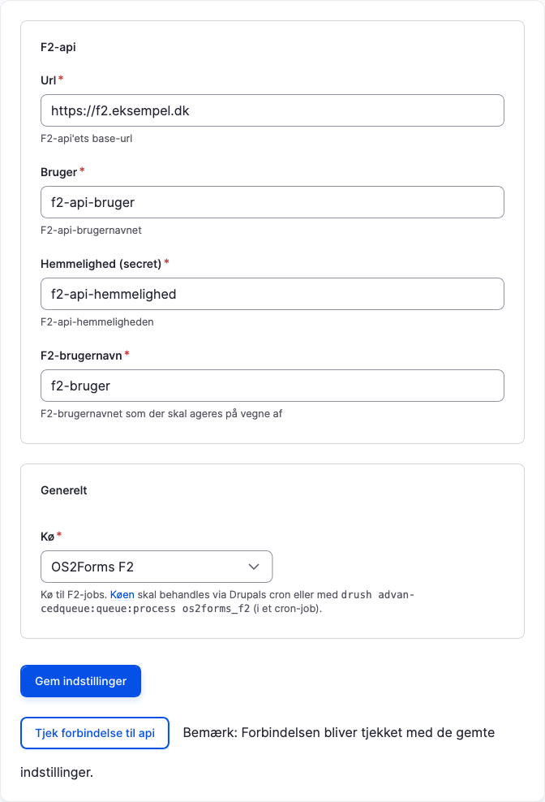

# Administrator

Generelle indstillinger for F2-modulet laves under Administration > Indstillinger > OS2Forms F2
(`/admin/os2forms_f2/settings`), fx

Passende værdier for "Url", "Bruger", "Hemmelighed" og "F2-brugernavn" kan udleveres af en F2-administrator.
