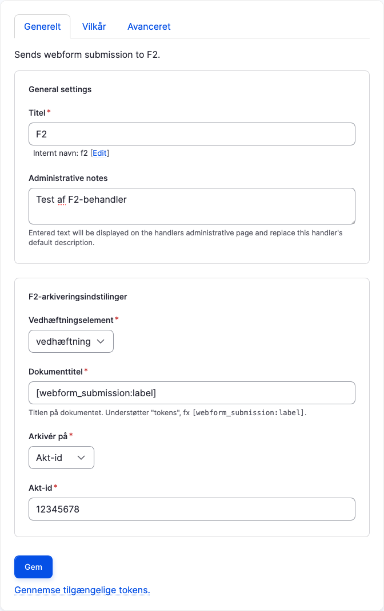
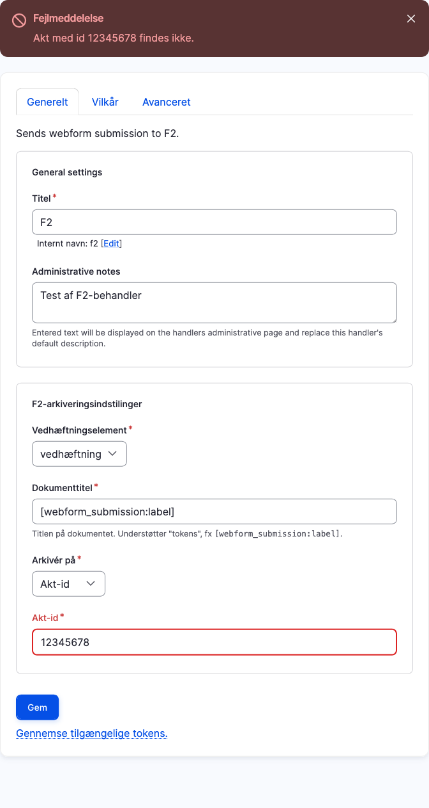
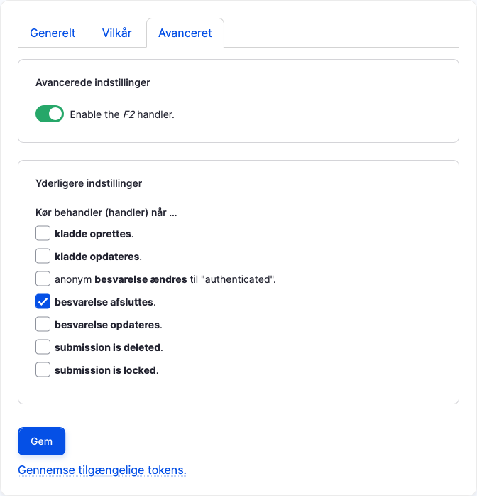

# Formularbygger

F2-behandleren kan arkivere indholdet i et vedhæftningselement (OS2Forms Attachment) i F2. Behandleren indsættes ligesom
andre handles og konfigureres på passende vis.

Akt-id'et skal udpege en akt der allerede er oprettet i F2, og når man gemmer indstillingerne kontrolles at akten
findes og i tilfælde af fejl vises en passende fejlbesked:

På fanen "Avanceret" kan man styre hvornår behandleren skal arkivere i F2:

> [!NOTE]
> Standardindstillingen, "Kør når … besvarelse afsluttes", vil oftest være det rigtige valg og kun i sjældne tilfælde
> vil det være nødvendigt at vælge noget andet.
